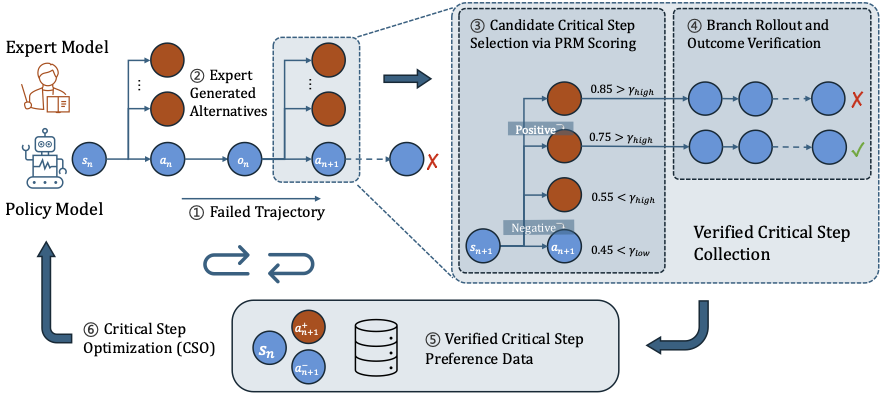

# Verified Critical Step Optimization (CSO) for LLM Agents

[](https://arxiv.org/abs/2602.03412) 
[](https://www.python.org/downloads/)
[](https://opensource.org/licenses/Apache-2.0)

<p align="center">
  
</p>

## 🌟 Introduction

**Critical Step Optimization (CSO)** is a novel post-training approach for LLM agents that focuses preference learning on **verified critical steps** where alternative actions demonstrably change task outcomes from failure to success. Unlike trajectory-level methods that apply coarse rewards uniformly, CSO provides fine-grained, step-specific supervision grounded in verified outcomes.

### Key Features

- 🎯 **Verified Critical Steps**: Only optimize on steps where alternative actions provably flip task outcomes
- 🔍 **PRM-Guided Identification**: Use Process Reward Models to efficiently identify candidate critical steps
- ✅ **Outcome Verification**: Ground supervision in verified task success through branch rollouts
- 📊 **Efficient Supervision**: Achieve superior performance with supervision at only ~16% of trajectory steps
- 🚀 **Strong Performance**: 37% and 26% relative gains over SFT baseline on GAIA and XBench-DeepSearch

### How It Works

1. **Collect Failed Trajectories**: Run policy model on tasks, collect failed attempts
2. **Identify Critical Steps**: Use PRM to score alternative actions at each step
3. **Branch & Verify**: Replace policy action with high-scoring alternative and rollout to completion
4. **Generate Preferences**: Create verified DPO pairs only when alternative leads to success

## 📂 Repository Structure

```
CSO/
├── system/ckv3/              # Core CK system implementation
│   ├── agents/               # Agent modules, reward models
│   ├── ck_main/              # Main CK system
│   ├── ck_web/               # Web environment support
│   └── ck_file/              # File processing utilities
│
└── scripts/
    ├── inference/            # Inference scripts
    │   ├── run_gaia_with_planning_no_prm_l1_v0_ck.sh      # Policy model baseline
    │   ├── run_gaia_with_planning_no_prm_l1_v0_ck_dpo.sh  # CSO-trained model
    │   ├── run_resample_prm.sh                             # PRM resampling
    │   └── run_continue_from_checkpoint.sh                 # Checkpoint continuation
    │
    └── data_processing/      # Data generation
        ├── convert_prm_to_llamafactory_dpo.py    # Standard DPO (no verification)
        ├── verify_and_generate_dpo.py            # ✨ Verified CSO DPO
        └── run_verify_and_generate_dpo.sh        # ✨ CSO pipeline
```

## 🚀 Quick Start

### Installation

This project is based on [Cognitive Kernel-Pro](https://github.com/Tencent/CognitiveKernel-Pro) with custom modifications for CSO.

```bash
# Clone repository
git clone https://github.com/kiaia/CSO.git
cd CSO

# Install dependencies
pip install playwright anthropic openai azure-identity flask flask-cors
playwright install chromium

# Set Python path
export PYTHONPATH="${PYTHONPATH}:$(pwd)"
```

See [SETUP_GUIDE.md](SETUP_GUIDE.md) for detailed installation instructions.

### Environment Setup

```bash
# Configure your API keys
export AZURE_OPENAI_API_KEY="your_key"
export AZURE_OPENAI_ENDPOINT="your_endpoint"

# Or for OpenAI
export OPENAI_API_KEY="your_key"
```

## 📖 Usage

### Complete CSO Pipeline

#### Step 1: Collect Failed Trajectories

First, run your **policy model** (base model before CSO training) on your task dataset:

```bash
cd scripts/inference

# Configure your policy model endpoint (vLLM served)
export LLM_URL="http://your-policy-model:8081/v1/chat/completions"

# Run policy model to collect trajectories
bash run_gaia_with_planning_no_prm_l1_v0_ck.sh
```

**Input**: Task dataset with queries and ground truth answers  
**Output**: Agent trajectories (both successful and **failed**)  
**Note**: We focus on **failed trajectories** for CSO - these contain the critical decision points we want to optimize.

#### Step 2: Resample with PRM

For each step in failed trajectories, generate alternative actions and score them with PRM:

```bash
bash run_resample_prm.sh
```

**Input**: Failed trajectories from Step 1  
**Output**: Trajectories with PRM scores for alternative actions at each step

#### Step 3: Generate Verified CSO Data

Execute high-scoring branches to verify they lead to correct answers:

```bash
cd ../data_processing
bash run_verify_and_generate_dpo.sh
```

**Input**: PRM-resampled trajectories  
**Output**: Verified DPO pairs in LLaMAFactory format

**Key thresholds** (configurable in script):
- `GOOD_MIN=0.6`: Minimum PRM score for chosen action
- `BAD_MAX=0.5`: Maximum PRM score for rejected action

#### Step 4: Train with CSO Data

Train your model using the verified DPO data with LLaMAFactory:

```bash
llamafactory-cli train \
    --stage dpo \
    --model_name_or_path your_base_model \
    --dataset verified_cso_dpo \
    --output_dir output/cso_model \
    --per_device_train_batch_size 4 \
    --learning_rate 5e-6 \
    --num_train_epochs 3
```

#### Step 5: Deploy and Evaluate

Deploy your trained model using vLLM:

```bash
# Serve your CSO-trained model
vllm serve your_trained_model \
    --port 8081 \
    --max-model-len 32000
```

Evaluate the CSO-trained model:

```bash
cd ../inference
# Configure to use your trained model endpoint
export LLM_URL="http://localhost:8081/v1/chat/completions"
bash run_gaia_with_planning_no_prm_l1_v0_ck_dpo.sh
```

## Citation

If you use this code or find our work helpful, please cite:

```bibtex
@misc{li2026verifiedcriticalstepoptimization,
      title={Verified Critical Step Optimization for LLM Agents}, 
      author={Mukai Li and Qingcheng Zeng and Tianqing Fang and Zhenwen Liang and Linfeng Song and Qi Liu and Haitao Mi and Dong Yu},
      year={2026},
      eprint={2602.03412},
      archivePrefix={arXiv},
      primaryClass={cs.CL},
      url={https://arxiv.org/abs/2602.03412}, 
}
```

## Related Work

- **Cognitive Kernel-Pro**: [GitHub](https://github.com/Tencent/CognitiveKernel-Pro) | [Paper](https://arxiv.org/abs/2508.00414)
- **DeepVerifier**: [Paper](https://arxiv.org/abs/2601.15808)
- **Agent Self-Evolving Research**: [WebEvolver, WebCoT](https://github.com/Tencent/SelfEvolvingAgent), [WebVoyager](https://github.com/MinorJerry/WebVoyager), [OpenWebVoyager](https://github.com/MinorJerry/OpenWebVoyager), [WebAggregatorQA](https://github.com/Tencent/WebAggregator).

## License

This project is licensed under the Apache License 2.0.

## Acknowledgments

This work builds upon [Cognitive Kernel-Pro](https://github.com/Tencent/CognitiveKernel-Pro) from Tencent AI Lab. We've made modifications for CSO - please install from this repository for compatibility.
